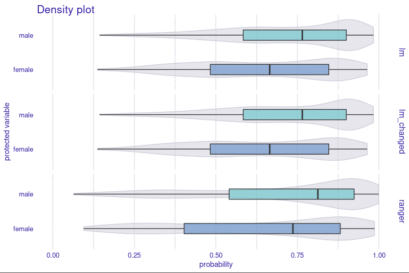
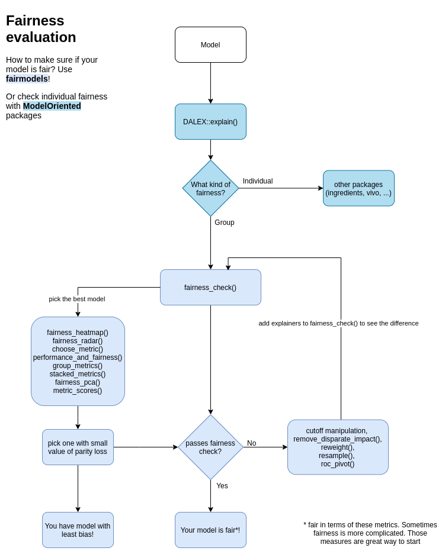

# fairmodels 

  <!-- badges: start -->
  [](https://codecov.io/gh/ModelOriented/FairModels?branch=master)
  [](https://github.com/ModelOriented/FairModels/actions)
  <!-- badges: end -->
  
  


## Overview

`fairmodels` is package for fairness audit and visualization. Uses models explained with [DALEX](https://modeloriented.github.io/DALEX) and calculates fairness metrics based on confusion matrix for protected group.  Allows to compare and gain information about various machine learning models. *Make sure your models are classifying protected groups similarly*.


## Preview




### How to evaluate fairness? 



## Installation

```
devtools::install_github("ModelOriented/fairmodels")
```

## Example
Checking fairness is easy! 

```
library(fairmodels)

library(ranger)
library(DALEX)

data("german")

# ------------ step 1 - create model(s)  -----------------

y_numeric <- as.numeric(german$Risk) -1

lm_model <- glm(Risk~.,
                data = german,
                family=binomial(link="logit"))

rf_model <- ranger(Risk ~.,
                   data = german,
                   probability = TRUE,
                   num.trees = 200)

# ------------  step 2 - create explainer(s)  ------------

explainer_lm <- explain(lm_model, data = german[,-1], y = y_numeric)
explainer_rf <- explain(rf_model, data = german[,-1], y = y_numeric)

# ------------  step 3 - fairness check  -----------------

fobject <- fairness_check(explainer_lm, explainer_rf,
                          protected = german$Sex,
                          privileged = "male")

# quick fairness check: 
print(fobject)
plot(fobject)

# detailed fairness check
library(dplyr)

fobject %>% plot_density()
fobject %>% fairness_heatmap() %>% plot() 
fobject %>% fairness_radar() %>% plot() 
fobject %>% stack_metrics() %>% plot() 
fobject %>% group_metric() %>% plot() 
fobject %>% choose_metric() %>% plot() 
fobject %>% performance_and_fairness() %>% plot() 

fobject %>% all_cutoffs("lm") %>% plot()
fobject %>% ceteris_paribus_cutoff("female") %>% plot()
```


### Fairness checking is flexible

`fairness_check` parameters are    
* x, ...  - `explainers` and `fairness_objects` (products of fairness_check).   
* protected - factor with different subgroups as levels. Usually specific race, sex etc...   
* privileged - subgroup, base on which to calculate parity loss metrics.    
* cutoff  - custom cutoff, might be single value - cutoff same for all subgroups or vector - for each subgroup individually. Affecting only explainers.   
* label - character vector for every explainer.   

Models might be trained on different data, even without protected variable. May have different cutoffs which gives different values of metrics. 
`fairness_check()` is place where `explainers` and `fairness_objects` are checked for copmatibility and then glued together.  
So it is possible to to something like this: 

```
fairness_object <- fairness_check(explainer1, explainer2, ...)
fairness_object <- fairness_check(explainer3, explainer4, fairness_object, ...)
```
even with more `fairness_objects`!

Tutorial: [Tutorial](https://modeloriented.github.io/FairModels/articles/Basic_tutorial.html)

## Metrics used: 

There are 13 metrics based on confusion matrix : 

| Metric | Formula | Full name | Other names |
|--------|---------|-----------|-------------|
| TPR | $\frac{TP}{TP+FN}$ | true positive rate | equal opportunity, sensitivity, recall
| TNR | $\frac{TN}{TN+FP}$ | true negative rate | specificity
| PPV | $\frac{TP}{TP+FP}$ | positive predictive value | predictive parity, precision
| NPV | $\frac{TN}{TN+FN}$ | negative predictive value | 
| FNR | $\frac{FN}{FN+TP}$ | false negative rate |
| FPR | $\frac{FP}{FP+TN}$ | false positive rate | predictive equality
| FOR | $\frac{FN}{FN+TN}$ | false omision rate |
| TS | $\frac{TP}{TP+FN+FP}$ | threat score |
| STP | $\frac{TP+FP}{TP+FN+FP+TN}$ | statistical parity |
| ACC | $\frac{TP+TN}{TP+FN+FP+TN}$ | accuracy |
| F1 | $2*\frac{PPV*TPR}{PPV + TPR}$ | F1 score |
| MCC |$\frac{TP*TN-FP*FN}{\sqrt{(TP+FP)*(TP+FN)*(TN+FP)*(TN+FN)}}$ | Matthews correlation coefficient |

*and their parity loss*
how *parity loss* is calculated? 

$TPR_{parity\_loss}$ = $\sum_{i}^{k} |TPR_i - TPR_{privileged}|$ where $i \in \{a, b, ..., privileged, ..., k \}$   
Where $\{a, b, ..., privileged, ..., k \}$ denote membership to unique subgroup from protected variable


more on those metrics : [Confusion Matrix](https://en.wikipedia.org/wiki/Confusion_matrix)

some fairness metrics like *Equalized odds* are satisfied if parity loss in both *TPR* and *FPR* is low 

## Related works

Zafar,Valera, Rodriguez, Gummadi (2017)  https://arxiv.org/pdf/1610.08452.pdf
